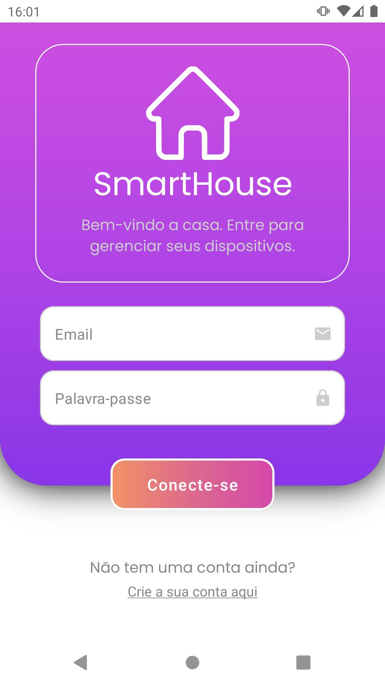
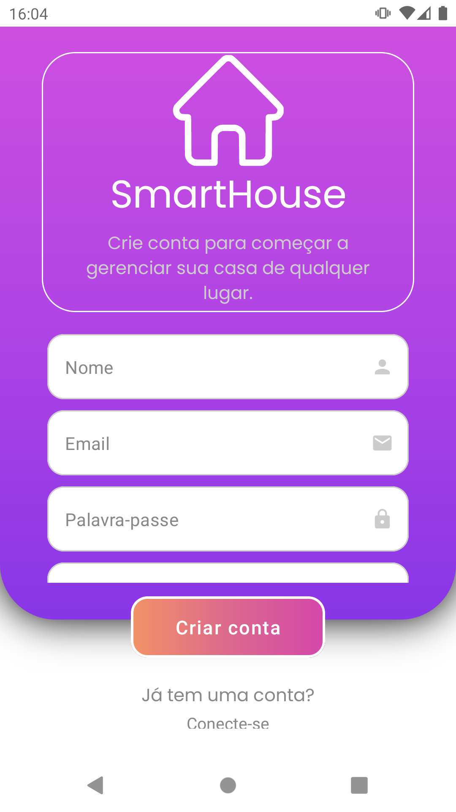
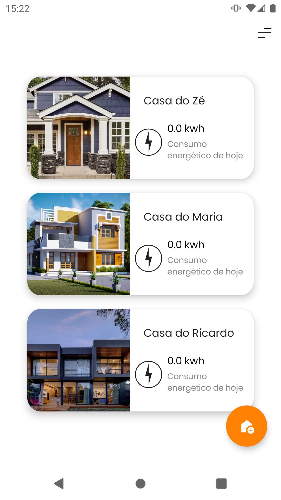
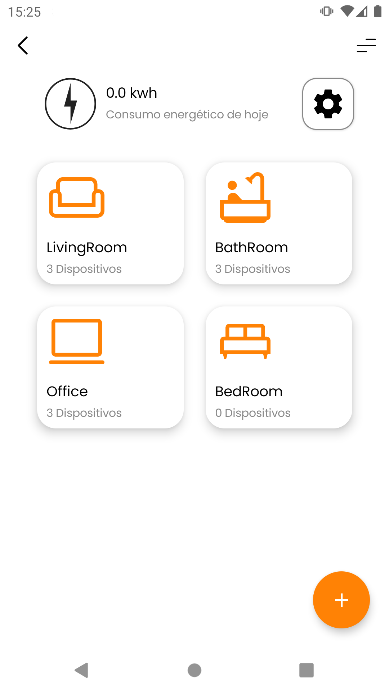
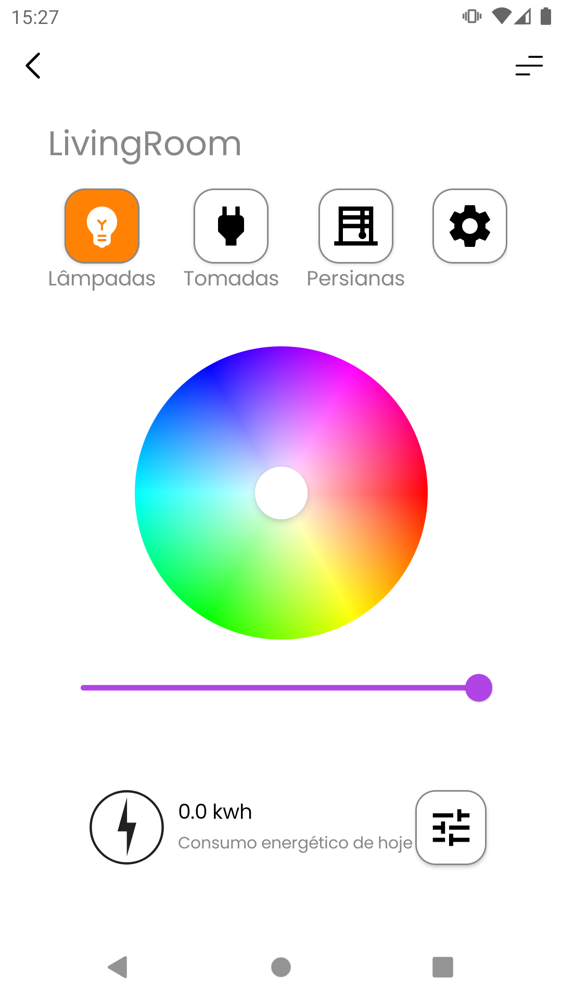
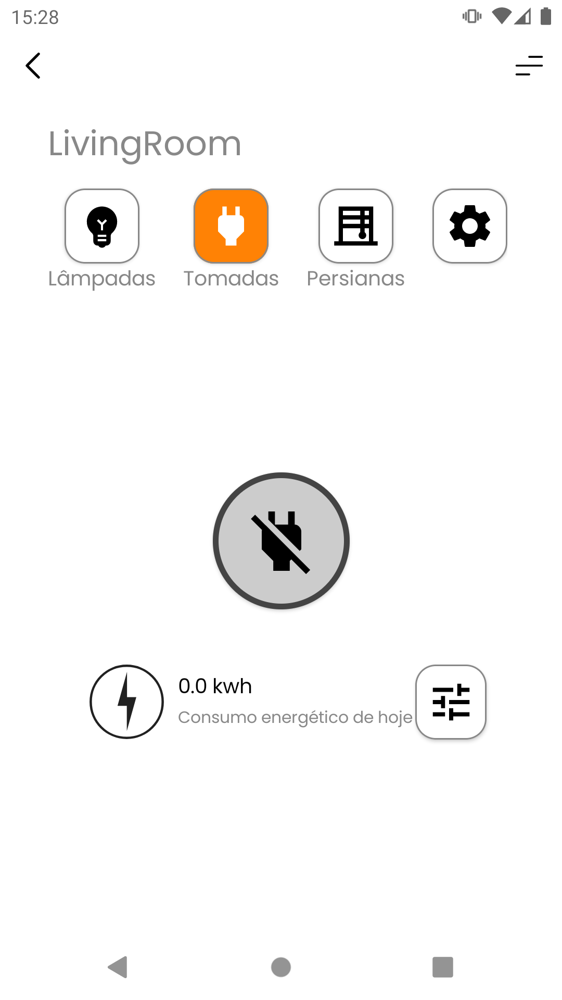
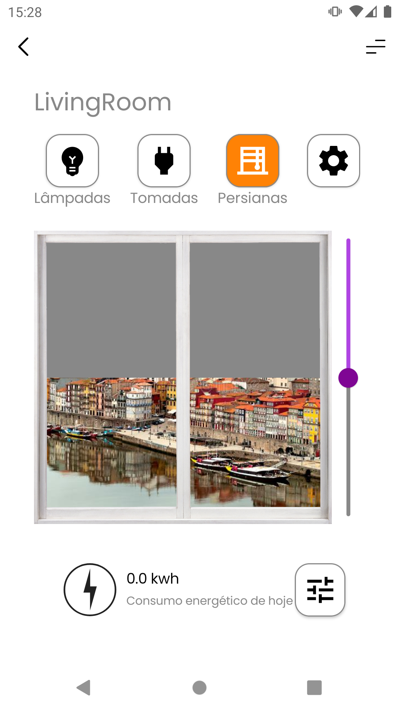
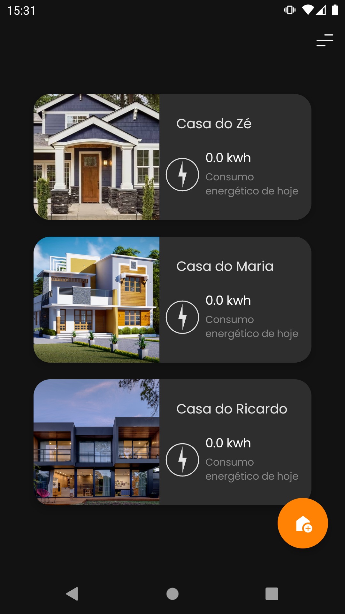

<h1 align="center">Practical Work on Computação Móvel e Ubíqua (Mobile and Ubiquitous Computing)</h1>

<p>
  
  
  
  <a href="https://github.com/nunofbcastro-ESTG-IPP/CMU_2022_2023/blob/main/Trabalho_Pratico.pdf" target="_blank">
    
  </a>
  <a href="https://github.com/nunofbcastro-ESTG-IPP/CMU_2022_2023/blob/main/Relat%C3%B3rioGrupo7.pdf" target="_blank">
    
  </a>
</p>

---

<h2>Screens</h2>

---

<h3>Authentication</h3>

 

---

<h3>Sensors</h3>

 

---

<h3>Listings</h3>

  

---

<h3>Color mode</h3>

 

---

<h2>Languages</h2>
<p align="left"> 
  
  
  
  
  
  
</p>

---

<h2>How to run</h2>

<h3>API</h3>

To simulate the sensors, we will use a Node.js project.

```
cd shelly-mock-api-master
npm install
npm start plug 20 light 20 blind 20
```

or

```
cd shelly-mock-api-master
docker compose up
```

After running this command, the API is available at the IP address 10.0.2.2 if you run it on the emulator or the device where you ran the API, otherwise it will be the IP of the device where the API was executed. The ports used for the shutter devices range from 3000 to 3019, while the ports used for the socket devices range from 3020 to 3039, and the ports used for the lighting devices range from 3040 to 3059.

<h3>Android project</h3>

1. Importing Database Folder Files to Firebase using Firestore:
   In order to import the files from the Database folder to Firebase, the Firestore service must be used. This can be done by logging into the Firebase console, creating a new database, and then using the import option to select the files from the Database folder.

1. Exporting the google-services.json File from Firebase:
   The google-services.json file is crucial for connecting the project to Firebase. To export this file, log into the Firebase console, go to the project settings, and select the "Download google-services.json" option. Then, add the file to the CMU_07_8200398_8200591_8200592\app folder.

1. Modifying the AndroidManifest.xml File:
   Finally, the AndroidManifest.xml file needs to be modified in order to change the value of the android:value attribute to the appropriate key for the Google Maps API. This can be done by opening the file in a text editor, locating the relevant line of code, and changing the value to the key that was obtained from the Google Maps API Console.

```
<meta-data
  android:name="com.google.android.geo.API_KEY"
  android:value="key"
/>
```

4. To run the project in Android Studio, open the project, click on the "Run" button, or select "Run" from the "Run" menu, and verify the output to ensure the changes made to the project have taken effect.

5. The project also contains UI tests and unit tests to verify the visual appearance and behavior of the app and the individual units of code, respectively, ensuring the quality and reliability of the application.

---

<h2>Authors</h2>

<h3>
  Nuno Castro
  <a href="https://github.com/nunofbcastro?tab=followers">
    
  </a>
</h3>

<h3>
  Jorge Correia
  <a href="https://github.com/JorgeMFC?tab=followers">
    
  </a>
</h3>

<h3>
  Luís Sousa
  <a href="https://github.com/luisousa14?tab=followers">
    
  </a>
</h3>
